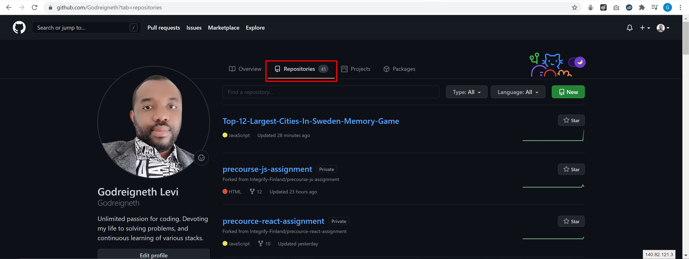

# Memory Game - Top 12 Largest Cities In Sweden

## A clean, beautiful and responsive Memory Game made with **HTML5**, **CSS3**, **Bootstrap**, **JQuery** and **JavaScript**.

This is a single page **Memory Game** website, designed with the Swedish National flag color, in which users play game and learn about **Top 12 Largest Cities In Sweden**.

The website **NavBar** contains only the NavBar-Brand as **MEMORY GAME**, afterwards below is a **NavBar-Alert** in yellow that displays information on how to play the game.

The **Memory Game** have the game **Time** displayed on the left, the **Start Game** buttom at the center, and the **Moves** on the right.

There is a game **Board** page, with title **Top 12 Largest Cities In Sweden**, with 24 cards matching the Top 12 Largest Cities In Sweden. 

The **Memory Game** have an **End Game Greeting Message** with a greetng **Congratulations!**, with a Total Game **Time**, **Moves**, **Developer**, and **Share Buton**

Finally, the **Footer** section of the **Memory Game** contains the **Developer** information, and **Disclaimer** notice.

## Demo

You can find live preview for this project [here](https://godreigneth.github.io/Top-12-Largest-Cities-In-Sweden-Memory-Game/)
<video width="100%" controls autoplay><source src="/assets/images/Top_12_Largest_Cities_In_Sweden.mp4" type="video/mp4" style="margin: 0"></video>

## UX

This project is for any users around the globe who is looking to learn more about the Swedish society and know about the Top 12 Largest Cities In Sweden in a fun way as they play game.

### User story:

- User plays the game by clicking on **Start Game** button, the **Time** begins to count, and **Moves** are recorded when user clicks on each **Card**.

- User MUST flip same card to match, and move to the best card.

- User MUST complete the game by flipping and matching all cards right before game ends with a greeting message **Congratulations!**. 

- User can end or restart the game by clicking on the **Memory Game** logo at the top or by refreshing the page.

See wireframe below;
#### Desktop: Before Startng the Game.

#### Tablet: Before Startng the Game.

#### Mobile: Before Startng the Game.

////////////////////////////////////////////////////////////////////////////////////////////////////////////////////////////////////

#### Desktop: Game End.

#### Tablet: Game End.

#### Mobile: Game End.

## Features

### NavBar Section
This section contains NavBar-Brand name.

### Below NavBar-Alert
This section contains information and instruction on how to play the game.

### Game Header Section
This section contains contains the ***Time***, ***Start Game*** button and the ***Moves*** displays.

### Main Game Section
This section contains containts the ***Game Title***, ***Game Room*** and the ***Game Cards***.

### End Game Greeting
The ***End Game Greeting*** is the pop-up that comes up after a user successfully completed flipping and matching all ***Game Cards***. And it contains a greetng **Congratulations!**, with a Total Game **Time**, **Moves**, **Developer**, and **Share Buton**

### Footer Section
This section contains the **Developer** information, and **Disclaimer** notice.

## Features Left to Implement

- Background Music
- Reward Points
- Advertisement
- Add More Sections

## BUGS

## Technologies Used

Here are Technologies used for this project, and it's functions.

- [HTML5](https://html.spec.whatwg.org)

  - The project uses **HTML5** for it's structuring.

- [CSS3](https://www.w3.org/Style/CSS/Overview.en.html)

  - The project uses **CSS3** for it's styling.

- [Bootstrap](https://getbootstrap.com)

  - The project uses **Bootstrap** starter template, in other to quickly design and customize responsive mobile-first site.

- [Font Awesome](https://fontawesome.com)

  - The project uses **Font Awesome** to get vector icons and social logos.

- [Google Fonts](https://fonts.google.com)

  - The project uses **Google Fonts** for great Typography.

- [JavaScript](https://en.wikipedia.org/wiki/JavaScript)
  - The project uses **JavaScript** for the scripting and implementing of some complex features.

- [JQuery](https://jquery.com)
  - The project uses **JQuery** through the JQuery CDN.

## Testing
- All the HTML codes were run and tested through [HTML TESTER](https://validator.w3.org/nu/?doc=https%3A%2F%2Fgodreigneth.github.io%2FTop-12-Largest-Cities-In-Sweden-Memory-Game%2F). This project was tested across multiple browsers and on multiple mobile devices, tablets and desktops to ensure compatibility and responsiveness.
- Whole CSS was validated and tested through [Jigsaw/CSS](https://jigsaw.w3.org/css-validator/validator#css) Congratulations! No Error Found. This document validates as CSS level 3 + SVG ! 
- The JavaScript codes was tested with [Jshint](https://jshint.com), in other to detect bugs and achieving an error free code at the end.

| Test Scenario | Status |
| --- | --- |
| As a user, when they click on **Memory Game** nav link they should navigate to index page section and refresh | Pass |
| As a user, when they click on the green **Start Game** button, the game starts playing | Pass |
| As a user, when the game ends, they click on the yellow **Again** buuton, to reset the game in other to paly game again | Pass |
| As a user, when they click on **Share Link** icon, they should be redirected to the appropriate social media site for sharing | Pass |
| As a user, when they click on the Developed by link should navigate to my personal profile page | Pass |

## Deployment

This project is deployed and hosted using GitHub directly from the master branch.

Here are different actions taken in other to get the project deployed:

- I started by creating a new repository with " <code>git init</code> ". 

- Then each update was done by the command " <code>git add .</code> ".

- And then committing it to my local repo with the command " <code>git commit -m "message"</code> ". 

- Then I uploaded it to my remote repo (Github) using " <code>git push</code> ".

- Opened up repositories on GitHub.
- Selected **Top-12-Largest-Cities-In-Sweden-Memory-Game** repository.
- Clicked on settings buttom.
- Scrolled down and hosted pages thorugh GitHub Pages by selecting master branch as main source.
- Wait for a while, as the project is been deployed to GitHub, and a GitHub subdomain link generated for the live project.

### In addition, below are screenshots presentation of the deployment process.

#### First Step: Opened up repositories on my GitHub.

#### Second Step: Selected cv repository.

#### Third Step: Navigate and click settings icon.

#### Forth Step: Scroll down, press dropdown button under Source section which is in GitHub Pages section, select master branch as source of your deployment.

#### Final Step: Wait a little bit, refresh the page and the site has been deployed at the link generated.

## Credits

### Content

- Writeup contents are my own ideas. 

### Media

- Photos and images used on this site were obtained from <a href="https://en.wikipedia.org/wiki/List_of_urban_areas_in_Sweden_by_population" target="_blank">here</a>
- All images are property of their respective owners. 
- No Copyright infringement intended.

### Acknowledgements

- I received inspiration for this project from <strong>Family and Friends</strong></a>
- I received inspiration for this project because of my love for the <strong>Swedish society</strong></a>
- I received inspiration for this project from my [Code Institute](https://codeinstitute.net/) Mentor <a href="https://github.com/nishant8BITS" target="_blank"><strong>Nishant Kumar</strong></a>

